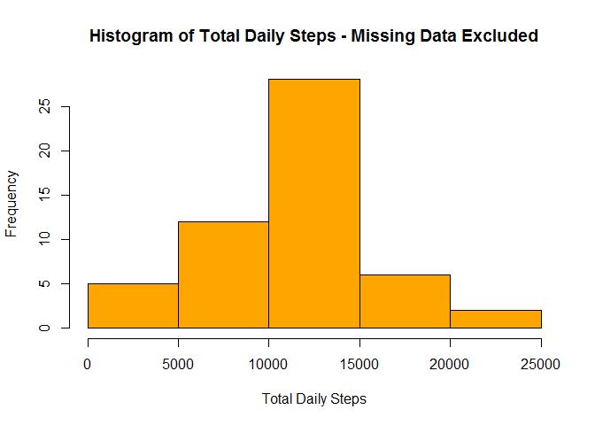
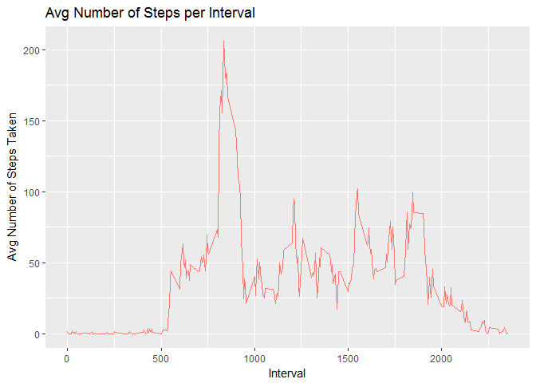
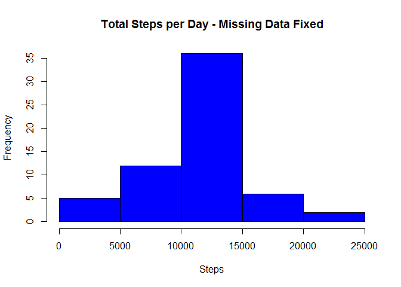
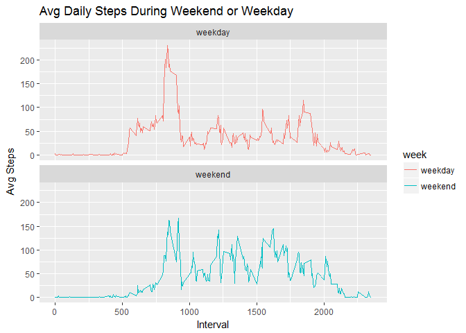

# Reproducible Research Course Project 1
Francis Brua  
May 19, 2017  


## Loading the Data


```r
df <- read.csv("activity.csv")
```
### 1. What is mean total number of steps taken per day?

#### 1.1 Calculate the total number of steps taken per day

```r
daily.steps <- aggregate(df$steps ~ df$date, FUN = sum)
colnames(daily.steps) <- c("date", "steps")

## Remove NAs
daily.steps <- daily.steps[!is.na(daily.steps$steps),]
```

#### 1.2 Make a Histogram of the total number of steps taken each day

```r
hist(x=daily.steps$steps, col = "orange", xlab = "Total Daily Steps", main = "Histogram of Total Daily Steps - Missing Data Excluded")
```

<!-- -->

#### 1.3 Calculate and Report the Mean and Mediam of the total number of steps taken per day

Mean of Total Number of Steps Taken

```r
mean(daily.steps$steps, na.rm = TRUE)
```

```
## [1] 10766.19
```

Median of Total Number of Steps Taken

```r
median(daily.steps$steps, na.rm = TRUE)
```

```
## [1] 10765
```

### 2. What is the average daily activity pattern?

#### 2.1 Make a time series plot (i.e. type = "l") of the 5-minute interval (x-axis) and the average number of steps taken, averaged across all days (y-axis)


```r
library(dplyr)
```

```
## 
## Attaching package: 'dplyr'
```

```
## The following objects are masked from 'package:stats':
## 
##     filter, lag
```

```
## The following objects are masked from 'package:base':
## 
##     intersect, setdiff, setequal, union
```

```r
library(ggplot2)
```

```
## Warning: package 'ggplot2' was built under R version 3.3.3
```

```r
df.interval <- group_by(df, interval) %>%
 summarize(avg = mean(steps, na.rm = TRUE))

tsplot <- ggplot(df.interval, aes(x=interval, y = avg))
tsplot + geom_line(aes(color = "red"), show.legend = F) + xlab("Interval") + ylab("Avg Number of Steps Taken") + ggtitle("Avg Number of Steps per Interval")
```

<!-- -->

#### 2.2 Which 5-minute interval, on average across all the days in the dataset, contains the maximum number of steps?


```r
max.steps <- df.interval$interval[which.max(df.interval$avg)]
max.steps
```

```
## [1] 835
```

### 3. Imputing missing Values

#### 3.1 Calculate and report the total number of missing values in the dataset (i.e. the total number of rows with NAs)


```r
nrow(df[is.na(df$steps),])
```

```
## [1] 2304
```

#### 3.2 Devise a strategy for filling in all of the missing values in the dataset. The strategy does not need to be sophisticated. For example, you could use the mean/median for that day, or the mean for that 5-minute interval, etc.

Strategy: Input missing values with the mean of Steps for that 5 minute interval,

#### 3.3 Create a new dataset that is equal to the original dataset but with the missing data filled in.


```r
df.full <- df

df.interval <- group_by(df, interval) %>%
 summarize(avg = mean(steps, na.rm = TRUE))


for(i in 1:nrow(df.full)){
  if(is.na(df.full[i,]$steps)){
    df.full[i,]$steps <- df.interval[df.interval$interval == df.full[i,]$interval,]$avg
  }
}
```

#### 3.4 Make a histogram of the total number of steps taken each day


```r
daily.total <- aggregate(df$steps ~ df$date, FUN = sum, na.rm = TRUE)
daily.total.fixed <- aggregate(df.full$steps ~ df.full$date, FUN = sum)

hist(daily.total.fixed$`df.full$steps`, col = "blue", xlab = "Steps", main = "Total Steps per Day - Missing Data Fixed")
```

<!-- -->

#### 3.5 Calculate and report the mean and median total number of steps taken per day. 


```r
## Mean Total Steps Taken with no Missing Data
mean(daily.total.fixed$`df.full$steps`)
```

```
## [1] 10766.19
```

```r
## Median Total Steps Taken with no Missing Data
median(daily.total.fixed$`df.full$steps`)
```

```
## [1] 10766.19
```

- The MEAN total number of steps taken each day with no Missing Data did not Change
- The Median Total number of steps taken each day with no Missing Data increased by 0.01%

### 4. Are there differences in activity patterns between weekdays and weekends?

#### 4.1 Create a new factor variable in the dataset with two levels - "weekday" and "weekend" indicating whether a given date is a weekday or weekend day.


```r
df.full$date <- as.Date(df.full$date, "%Y-%m-%d")

df.full$week <- ifelse(weekdays(df.full$date) == "Saturday" | weekdays(df.full$date) == "Sunday", "weekend", "weekday")

df.interval.week <- df.full %>%
  group_by(interval, week) %>%
  summarize(avgStep = mean(steps))
```

#### 4.2 Make a panel plot containing a time series plot (i.e. type = "l") of the 5-minute interval (x-axis) and the average number of steps taken, averaged across all weekday days or weekend days (y-axis).


```r
plot <- ggplot(df.interval.week, aes(x=interval, y= avgStep, color = week)) + geom_line() + 
  labs(title = "Avg Daily Steps During Weekend or Weekday", x = "Interval", y = "Avg Steps") + 
  facet_wrap(~week, ncol = 1, nrow = 2)

print(plot)
```

<!-- -->
